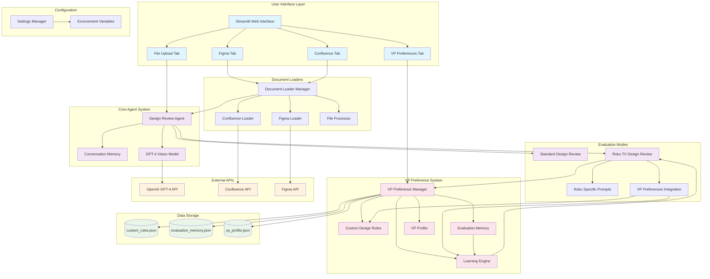
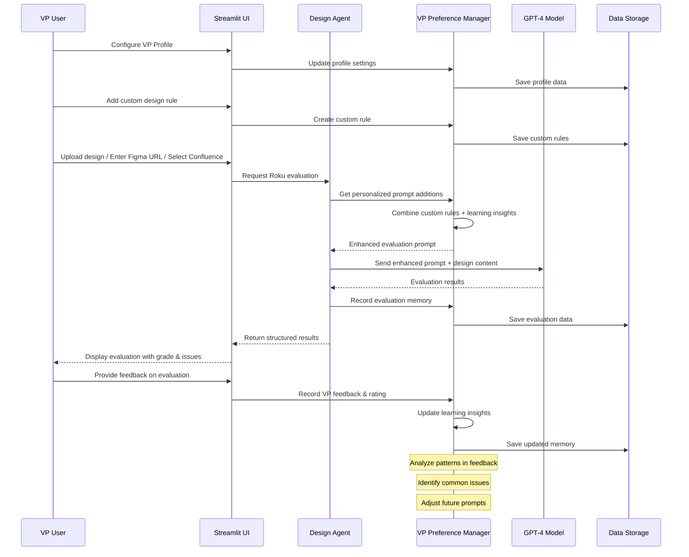

# System Architecture

## Mermaid Architecture Diagram

## Data Flow Architecture

## Component Details

### 1. **Streamlit UI Layer**
- **File Upload Tab**: Handles local image/PDF uploads
- **Figma Tab**: Processes Figma URLs and file keys
- **Confluence Tab**: Manages Confluence space/page analysis
- **VP Preferences Tab**: Custom rules, profile, feedback, and learning insights

### 2. **Core Agent System**
- **Design Review Agent**: Main orchestrator for all evaluations
- **Conversation Memory**: Maintains chat context and history
- **Evaluation Modes**: Standard review vs. Roku-specific evaluation

### 3. **VP Preference System**
- **Custom Rules Engine**: User-defined design requirements with rationale
- **Evaluation Memory**: Historical record of all evaluations and feedback
- **Learning Engine**: Analyzes patterns to improve future evaluations
- **VP Profile**: Personal preferences and evaluation style

### 4. **Document Processing**
- **Multi-source Support**: Files, Figma, Confluence
- **Content Extraction**: Text, images, design specifications
- **Format Normalization**: Consistent input for evaluation

### 5. **Learning & Adaptation**
- **Feedback Collection**: VP ratings and comments on evaluations
- **Pattern Recognition**: Common issues, grade distributions, preferences
- **Prompt Enhancement**: Dynamic addition of learned preferences
- **Continuous Improvement**: System gets better with each evaluation

## Key Features

### 🧠 **Adaptive Learning**
- Records every evaluation and VP feedback
- Identifies patterns in VP's preferences
- Automatically adjusts future evaluations
- Tracks accuracy improvements over time

### 🎯 **Personalization**
- Custom design rules with priority levels
- VP-specific communication style preferences
- Focus area customization
- Strict vs. lenient evaluation areas

### 📊 **Analytics & Insights**
- Evaluation history and trends
- Most common issue types
- Grade distribution analysis
- Learning effectiveness metrics

### 🔄 **Continuous Improvement**
- Feedback loop between evaluations and learning
- Custom rule refinement based on usage
- Prompt optimization through VP feedback
- Performance tracking and adjustment
