# Design Review Agent

A LangChain-powered AI agent for analyzing and reviewing design files, mockups, and design documents with support for multiple sources including local files, Figma, and Confluence.

## Architecture Overview

```mermaid
graph TB
    %% User Input Layer
    subgraph "User Interface (Streamlit)"
        UI[Streamlit Web App]
        FileUpload[📁 File Upload]
        FigmaInput[🎨 Figma URL]
        ConfluenceInput[📚 Confluence Pages]
        ChatInterface[💬 Interactive Chat]
    end

    %% AI Source Selection
    subgraph "AI Source Selection"
        AIHub[🏢 Roku AI Hub<br/>Enterprise]
        OpenAI[🔑 OpenAI API<br/>Premium]
        CloudAI[🆓 Free Cloud AI<br/>Groq/Together/HF]
        LocalAI[💻 Local AI<br/>Ollama]
    end

    %% Core Agent System
    subgraph "Core Agent System"
        MainAgent[Design Review Agent<br/>Primary Orchestrator]
        Memory[Conversation Memory<br/>Chat History]
        Router[Agent Router<br/>Source Selection]
    end

    %% Specialized Agents
    subgraph "Specialized AI Agents"
        HubAgent[AI Hub Reviewer<br/>Enterprise Models]
        CloudAgent[Cloud Reviewer<br/>Free/Low-cost APIs]
        LocalAgent[Local Reviewer<br/>Ollama Models]
        OpenAIAgent[OpenAI Agent<br/>GPT-4 Vision]
    end

    %% Content Processing Pipeline
    subgraph "Content Processing"
        DocLoader[Document Loaders<br/>Multi-source Support]
        ImageProcessor[Image Processor<br/>Vision Analysis]
        PDFProcessor[PDF Processor<br/>Text Extraction]
        FigmaConnector[Figma API<br/>Design Files]
        ConfluenceConnector[Confluence API<br/>Documentation]
    end

    %% Evaluation System
    subgraph "Evaluation System"
        StandardReview[Standard Design Review<br/>General/UI/UX/Accessibility]
        RokuReview[Roku TV Design Review<br/>10-foot UI/Remote Navigation]
        CustomRules[Custom Rules Engine<br/>User-defined Requirements]
    end

    %% VP Preferences & Learning
    subgraph "VP Preferences & Learning System"
        VPProfile[VP Profile<br/>Personal Preferences]
        CustomRequirements[Custom Requirements<br/>Design Rules]
        EvalMemory[Evaluation Memory<br/>Historical Data]
        LearningEngine[Learning Engine<br/>Pattern Analysis]
        FeedbackLoop[Feedback Loop<br/>Continuous Improvement]
    end

    %% Prompt System
    subgraph "Intelligent Prompting"
        BasePrompts[Base Prompts<br/>Review Templates]
        RokuPrompts[Roku Prompts<br/>TV Design Criteria]
        AdaptivePrompts[Adaptive Prompts<br/>Personalized Context]
    end

    %% Output Processing
    subgraph "Results Processing"
        ResultParser[Result Parser<br/>Structured Output]
        Grading[Letter Grading<br/>A-F Score System]
        Suggestions[Improvement Suggestions<br/>Actionable Feedback]
        Analytics[Analytics Dashboard<br/>Performance Insights]
    end

    %% External Integrations
    subgraph "External Services"
        FigmaAPI[Figma API<br/>Design Files]
        ConfluenceAPI[Confluence API<br/>Documentation]
        OllamaService[Ollama Service<br/>Local Models]
        AIHubService[Roku AI Hub<br/>Enterprise AI]
    end

    %% Flow Connections
    UI --> FileUpload
    UI --> FigmaInput
    UI --> ConfluenceInput
    UI --> ChatInterface

    FileUpload --> MainAgent
    FigmaInput --> MainAgent
    ConfluenceInput --> MainAgent
    ChatInterface --> MainAgent

    MainAgent --> Router
    Router --> AIHub
    Router --> OpenAI
    Router --> CloudAI
    Router --> LocalAI

    AIHub --> HubAgent
    OpenAI --> OpenAIAgent
    CloudAI --> CloudAgent
    LocalAI --> LocalAgent

    HubAgent --> AIHubService
    CloudAgent --> DocLoader
    LocalAgent --> OllamaService
    OpenAIAgent --> DocLoader

    DocLoader --> ImageProcessor
    DocLoader --> PDFProcessor
    DocLoader --> FigmaConnector
    DocLoader --> ConfluenceConnector

    FigmaConnector --> FigmaAPI
    ConfluenceConnector --> ConfluenceAPI

    MainAgent --> StandardReview
    MainAgent --> RokuReview
    StandardReview --> CustomRules
    RokuReview --> CustomRules

    MainAgent --> VPProfile
    VPProfile --> CustomRequirements
    VPProfile --> EvalMemory
    EvalMemory --> LearningEngine
    LearningEngine --> FeedbackLoop
    FeedbackLoop --> AdaptivePrompts

    BasePrompts --> MainAgent
    RokuPrompts --> MainAgent
    AdaptivePrompts --> MainAgent

    MainAgent --> ResultParser
    ResultParser --> Grading
    ResultParser --> Suggestions
    ResultParser --> Analytics

    MainAgent --> Memory

    %% Styling
    classDef userInterface fill:#e1f5fe
    classDef aiSource fill:#f3e5f5
    classDef coreSystem fill:#e8f5e8
    classDef processing fill:#fff3e0
    classDef evaluation fill:#fce4ec
    classDef learning fill:#f1f8e9
    classDef prompting fill:#e0f2f1
    classDef output fill:#fff8e1
    classDef external fill:#efebe9

    class UI,FileUpload,FigmaInput,ConfluenceInput,ChatInterface userInterface
    class AIHub,OpenAI,CloudAI,LocalAI aiSource
    class MainAgent,Memory,Router coreSystem
    class DocLoader,ImageProcessor,PDFProcessor,FigmaConnector,ConfluenceConnector processing
    class StandardReview,RokuReview,CustomRules evaluation
    class VPProfile,CustomRequirements,EvalMemory,LearningEngine,FeedbackLoop learning
    class BasePrompts,RokuPrompts,AdaptivePrompts prompting
    class ResultParser,Grading,Suggestions,Analytics output
    class FigmaAPI,ConfluenceAPI,OllamaService,AIHubService,HubAgent,CloudAgent,LocalAgent,OpenAIAgent external
```



## Features

- 📁 **File Upload**: Analyze local design files (images, PDFs)
- 🎨 **Figma Integration**: Direct analysis of Figma design files
- 📚 **Confluence Integration**: Review design documentation from Confluence pages
- 🤖 **AI-Powered Reviews**: Automated design feedback using GPT-4 Vision
- 🎯 **Multiple Review Types**: General Design, UI/UX, Accessibility, Brand Consistency
- 🏆 **Roku TV Design Review**: VP's comprehensive evaluation criteria with letter grading
- 💬 **Interactive Chat**: Discuss design decisions with the AI agent
- 📊 **Detailed Scoring**: Get quantitative design scores and qualitative feedback
- ⚙️ **VP Preferences System**: Customizable evaluation criteria that learns over time
- 🧠 **Adaptive Learning**: System improves based on VP feedback and preferences
- 📈 **Analytics Dashboard**: Track evaluation history, patterns, and learning insights

## Setup

1. **Install dependencies:**
```bash
source venv/bin/activate
pip install -r requirements.txt
```

2. **Set up environment variables:**
```bash
cp .env.example .env
# Edit .env with your API keys and configuration
```

3. **Required API Keys:**
   - **OpenAI API Key**: For AI-powered design analysis
   - **Figma Access Token**: For Figma file integration (optional)
   - **Confluence API**: For Confluence page integration (optional)

4. **Run the application:**
```bash
streamlit run app.py
```

## Configuration

### Environment Variables

Create a `.env` file with the following variables:

```env
# Required
OPENAI_API_KEY=your_openai_api_key_here

# Optional - LangChain Tracing
LANGCHAIN_TRACING_V2=true
LANGCHAIN_API_KEY=your_langchain_api_key_here
LANGCHAIN_PROJECT=design-review-agent

# Optional - Figma Integration
FIGMA_ACCESS_TOKEN=your_figma_access_token_here

# Optional - Confluence Integration
CONFLUENCE_URL=https://your-domain.atlassian.net
CONFLUENCE_USERNAME=your_email@domain.com
CONFLUENCE_API_KEY=your_confluence_api_key_here
```

### Getting API Keys

#### Figma Access Token
1. Go to Figma → Settings → Account
2. Scroll down to "Personal access tokens"
3. Click "Create a new personal access token"
4. Copy the token and add it to your `.env` file

#### Confluence API Key
1. Go to https://id.atlassian.com/manage-profile/security/api-tokens
2. Click "Create API token"
3. Copy the token and add it to your `.env` file along with your Confluence URL and username

## Usage

### 1. File Upload Analysis
- Upload PNG, JPG, JPEG, or PDF files
- Select review criteria and detail level
- Get instant AI-powered feedback

### 2. Figma Integration
- Paste Figma file URLs or enter file keys directly
- Optionally specify node IDs for targeted analysis
- Get comprehensive design reviews of your Figma files

### 3. Confluence Integration
- Enter Confluence space keys
- Optionally specify page IDs for targeted analysis
- Review design documentation and specifications

### 4. Interactive Chat
- Ask follow-up questions about your designs
- Get advice on specific design challenges
- Discuss design principles and best practices

### 5. VP Preferences & Learning System
- **Custom Rules**: Add your own design requirements with rationale
- **VP Profile**: Configure evaluation style and focus areas
- **Learning Insights**: Track what the system learns from your feedback
- **Feedback Loop**: Rate evaluations to improve future assessments
- **Adaptive Prompts**: System automatically incorporates learned preferences

## Review Types

- **General Design**: Overall visual hierarchy, color, typography, and aesthetics
- **UI/UX**: User interface usability, navigation, and user experience
- **Accessibility**: Color contrast, readability, and WCAG compliance
- **Brand Consistency**: Brand guideline adherence and visual consistency

## Project Structure

```
design-review-agent/
├── app.py                     # Main Streamlit application
├── agents/
│   ├── __init__.py
│   ├── design_reviewer.py     # Core design review agent
│   ├── document_loaders.py    # Figma & Confluence loaders
│   └── utils.py              # Utility functions
├── prompts/
│   ├── __init__.py
│   └── review_prompts.py     # LangChain prompt templates
├── config/
│   ├── __init__.py
│   └── settings.py           # Configuration settings
├── .github/
│   └── copilot-instructions.md # Copilot customization
├── venv/                     # Python virtual environment
├── requirements.txt          # Python dependencies
├── .env.example             # Environment variables template
├── .env                     # Your actual environment variables
├── .gitignore              # Git ignore rules
└── README.md               # This file
```

## Dependencies

Key packages used in this project:
- `langchain` - LangChain framework for AI agents
- `langchain-openai` - OpenAI integration for LangChain
- `streamlit` - Web interface framework
- `atlassian-python-api` - Confluence API integration
- `beautifulsoup4` - HTML parsing for document processing
- `pillow` - Image processing

## Deployment

### Local Development
```bash
streamlit run app.py
```

### Vercel Deployment
This project includes a Flask-based web interface for deployment on Vercel:

1. **Deploy to Vercel:**
   ```bash
   vercel --prod
   ```

2. **Set Environment Variables in Vercel:**
   - `OPENAI_API_KEY`: Your OpenAI API key
   - `FIGMA_ACCESS_TOKEN`: Your Figma access token (optional)
   - `CONFLUENCE_URL`: Your Confluence URL (optional)
   - `CONFLUENCE_USERNAME`: Your Confluence username (optional)
   - `CONFLUENCE_API_KEY`: Your Confluence API key (optional)

3. **Access Options:**
   - **Streamlit Interface** (Local): Full-featured interface with chat, VP preferences, etc.
   - **Flask Interface** (Vercel): Simplified web interface optimized for serverless deployment

The Flask interface (`/api/index.py`) provides a streamlined version of the design review functionality that works well with Vercel's serverless architecture.

## Contributing

1. Fork the repository
2. Create a feature branch
3. Make your changes
4. Submit a pull request

## Troubleshooting

### Common Issues

1. **Vercel 404 NOT_FOUND Error**
   - Ensure `vercel.json` is properly configured
   - Check that environment variables are set in Vercel dashboard
   - Verify the Flask app structure in `/api/index.py`

2. **Import Error for ConversationBufferMemory**
   - This has been fixed by importing from `langchain.memory` instead of `langchain_core.memory`

3. **Figma Access Token Invalid**
   - Ensure your token has the correct permissions
   - Check that the token hasn't expired

4. **Confluence Connection Issues**
   - Verify your Confluence URL format (should include https://)
   - Ensure your API token has proper permissions
   - Check that your username is correct

## License

MIT License - see LICENSE file for details.
