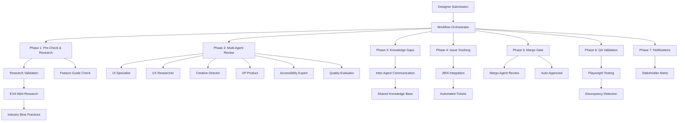

# Advanced Design Workflow Automation System

This is a comprehensive design review automation system that transforms the traditional design workflow into an intelligent, multi-agent orchestrated process. The system serves as a **pre-Margo gate** that handles common checks and balances, allowing face-to-face meetings to focus on higher-level strategic thinking.

## 🎯 Overview

The Advanced Workflow System addresses your complete design workflow requirements:

### 🤖 **Multi-Agent Design Review**
- **UI Specialist**: Design craft and visual consistency
- **UX Researcher**: User-centered analysis and research validation  
- **Creative Director**: Innovation and brand alignment
- **VP of Product**: Business strategy and ROI analysis
- **Accessibility Expert**: WCAG compliance and inclusive design
- **Quality Evaluator**: Feature guide validation and cross-referencing
- **Margo Agent**: Senior strategic review and final gate-keeping

### 🔄 **Intelligent Workflow Orchestration**

1. **Pre-Margo Screening**
   - Feature guide validation
   - Research history checking
   - Knowledge gap detection
   - Basic design review
   - Readiness assessment

2. **Margo Gate Decision**
   - Automated threshold evaluation
   - Strategic complexity assessment
   - Escalation to senior review when needed
   - Meeting preparation materials

3. **Post-Review Automation**
   - JIRA ticket creation for issues
   - QA validation with Playwright
   - Stakeholder notifications
   - Next steps generation

### 🧠 **Knowledge Management**
- **Gap Detection**: Identifies when agents lack knowledge
- **Inter-Agent Communication**: Agents can consult each other
- **Knowledge Sharing**: Builds institutional knowledge base
- **Research Automation**: Creates studies when research is missing

### 🎫 **Issue Tracking & Validation**
- **JIRA Integration**: Automated ticket creation for design/accessibility issues
- **Playwright QA Validation**: Cross-references QA implementation with design specs
- **Discrepancy Detection**: Identifies visual and functional differences
- **Automated Notifications**: Alerts corresponding teams

### 🔍 **Research Integration**
- **EXA Web Research**: Discovers industry best practices (Nielsen Norman, etc.)
- **Research Study Creation**: Generates research plans when gaps exist
- **Historical Research**: Checks if relevant research already exists
- **Evidence-Based Recommendations**: Grounds decisions in research

## 🚀 Quick Start

### 1. Installation

```bash
# Clone the repository
git clone https://github.com/your-org/margo-agent.git
cd margo-agent

# Create virtual environment
python -m venv venv
source venv/bin/activate  # On Windows: venv\Scripts\activate

# Install dependencies
pip install -r requirements.txt

# Install Playwright browsers (for QA validation)
playwright install
```

### 2. Environment Configuration

Create a `.env` file with your API keys:

```bash
# Required
OPENAI_API_KEY=your_openai_api_key_here

# Optional - Enhanced Features
EXA_API_KEY=your_exa_api_key_here          # Web research
JIRA_URL=https://yourcompany.atlassian.net  # Issue tracking
JIRA_USERNAME=your_email@company.com
JIRA_API_TOKEN=your_jira_api_token

# Optional - Notifications
SLACK_WEBHOOK_URL=your_slack_webhook_url
```

### 3. Run the Demo

```bash
# Run the complete workflow demo
python demo_advanced_workflow.py
```

### 4. Integration Examples

#### Basic Workflow Processing

```python
from agents.advanced_workflow_system import create_advanced_workflow_system

# Initialize system
system = create_advanced_workflow_system(
    openai_api_key="your_key",
    exa_api_key="your_exa_key",  # Optional
    jira_url="https://company.atlassian.net",  # Optional
    jira_username="email@company.com",  # Optional
    jira_api_token="token",  # Optional
    enable_playwright=True
)

# Process design submission
submission = {
    "design_type": "ui_design",
    "design_area": "checkout_flow", 
    "feature_type": "payment_integration",
    "impact_level": "high",
    "image_data": "base64_encoded_image_data",
    "feature_guide": "Feature guide content...",
    "qa_link": "https://qa.yourapp.com/checkout",
    "design_spec_url": "https://figma.com/file/example",
    "context": {
        "designer": "John Doe",
        "stakeholders": ["product_team", "engineering_team"]
    }
}

result = await system.process_complete_design_workflow(submission)
print(f"Workflow completed: {result['workflow_id']}")
```

#### Inter-Agent Communication

```python
# Agents can request knowledge from each other
request_id = await system.communication_hub.request_knowledge(
    requester="ui_specialist",
    topic="accessibility",
    specific_question="What are WCAG requirements for button contrast?",
    urgency=Priority.MEDIUM
)

# Agents can escalate complex issues
escalation_id = await system.communication_hub.escalate_issue(
    escalator="accessibility_expert",
    issue={
        "title": "Complex accessibility requirement",
        "type": "accessibility",
        "severity": "high"
    },
    escalation_reason="Requires strategic decision"
)
```

## 🏗️ System Architecture



## 🎯 Key Workflows

### Design Review Workflow

1. **Submission Processing**
   - Designer submits design with context
   - System validates feature guide
   - Checks research history
   - Assesses readiness

2. **Multi-Agent Review**
   - Parallel agent analysis
   - Consensus building
   - Issue identification
   - Knowledge gap detection

3. **Decision Making**
   - Margo gate evaluation
   - Threshold-based decisions
   - Escalation when needed
   - Approval automation

4. **Quality Assurance**
   - QA validation (if link provided)
   - Visual discrepancy detection
   - Accessibility compliance
   - Implementation verification

5. **Issue Management**
   - JIRA ticket creation
   - Stakeholder notification
   - Next steps generation
   - Progress tracking

### Knowledge Gap Resolution

1. **Gap Detection**
   - Uncertainty pattern recognition
   - Context analysis
   - Severity assessment
   - Agent capability mapping

2. **Expert Identification**
   - Expertise matching
   - Availability checking
   - Reliability scoring
   - Best expert selection

3. **Knowledge Exchange**
   - Structured questioning
   - Evidence-based responses
   - Confidence assessment
   - Knowledge storage

4. **Consensus Building**
   - Multi-source validation
   - Weighted consensus
   - Conflict resolution
   - Standard establishment

### Research Automation

1. **Research Need Assessment**
   - Impact level evaluation
   - Existing research check
   - Gap identification
   - Study requirement determination

2. **Study Creation**
   - Objective definition
   - Participant targeting
   - Timeline planning
   - Deliverable specification

3. **Research Execution**
   - JIRA ticket creation
   - Stakeholder assignment
   - Progress tracking
   - Results integration

4. **Knowledge Integration**
   - Findings documentation
   - Recommendation generation
   - Decision support
   - Future reference

## 🛠️ Configuration

### System Configuration

```python
config = AdvancedWorkflowConfig(
    openai_api_key="your_key",
    exa_api_key="your_exa_key",
    jira_url="https://company.atlassian.net",
    jira_username="email@company.com", 
    jira_api_token="token",
    playwright_enabled=True,
    playwright_browser="chromium",
    screenshots_dir="screenshots",
    margo_threshold_config={
        "min_overall_score": 7.0,
        "min_consensus_score": 0.8,
        "max_critical_issues": 2
    }
)
```

### Margo Gate Thresholds

```python
margo_thresholds = {
    "min_overall_score": 7.0,        # Minimum design review score
    "min_consensus_score": 0.8,      # Minimum agent consensus
    "max_critical_issues": 2,        # Maximum critical issues allowed
    "accessibility_score_min": 8.0,  # Minimum accessibility score
    "strategic_indicators": [         # Patterns requiring Margo review
        "strategic alignment",
        "business impact", 
        "competitive analysis",
        "market positioning"
    ]
}
```

### Agent Configuration

```python
# Customize agent capabilities
agents = {
    "ui_specialist": {
        "expertise": ["ui_design", "visual_design", "design_systems"],
        "response_time": 60,
        "reliability": 0.9
    },
    "accessibility_expert": {
        "expertise": ["wcag", "inclusive_design", "assistive_technology"],
        "response_time": 75,
        "reliability": 0.96
    }
}
```

## 📊 Monitoring & Analytics

### Workflow Metrics

- **Processing Time**: Average workflow completion time
- **Margo Escalation Rate**: Percentage requiring senior review
- **Issue Detection Rate**: Average issues found per review
- **QA Discrepancy Rate**: Implementation vs design mismatches
- **Knowledge Gap Frequency**: Common areas needing clarification

### Agent Performance

- **Response Time**: Average agent response times
- **Reliability Score**: Agent consistency rating
- **Expertise Utilization**: How often agents are consulted
- **Knowledge Contribution**: Agent knowledge sharing rate

### Quality Indicators

- **Design Score Trends**: Overall design quality over time
- **Accessibility Compliance**: WCAG compliance rates
- **Research Coverage**: Percentage of features with research
- **Stakeholder Satisfaction**: Feedback on workflow efficiency

## 🔧 Troubleshooting

### Common Issues

1. **Agent Communication Failures**
   ```python
   # Check agent registration
   print(system.communication_hub.agent_capabilities.keys())
   
   # Verify message queues
   messages = system.communication_hub.get_agent_messages("ui_specialist")
   ```

2. **JIRA Integration Issues**
   ```python
   # Test JIRA connection
   if system.jira:
       issue = system.jira.create_design_issue(
           title="Test Issue",
           description="Testing JIRA integration"
       )
       print(f"Test issue created: {issue}")
   ```

3. **Playwright Validation Issues**
   ```bash
   # Reinstall Playwright browsers
   playwright install --force
   
   # Check browser availability
   playwright install-deps
   ```

### Performance Optimization

1. **Parallel Processing**
   ```python
   # Enable parallel agent reviews
   config.parallel_reviews = True
   
   # Adjust agent load balancing
   config.max_concurrent_agents = 4
   ```

2. **Memory Management**
   ```python
   # Limit conversation history
   config.max_conversation_history = 100
   
   # Enable periodic cleanup
   config.cleanup_interval_hours = 24
   ```

## 🤝 Contributing

### Adding New Agents

1. **Create Agent Class**
   ```python
   class NewSpecialistAgent:
       def __init__(self, openai_key):
           self.name = "New Specialist"
           self.expertise = ["specialty_area"]
       
       async def review(self, design_data, context):
           # Agent logic here
           return ReviewResult(...)
   ```

2. **Register with System**
   ```python
   # Add to agent registration
   system.register_agent("new_specialist", NewSpecialistAgent(openai_key))
   ```

### Extending Integrations

1. **Add New Issue Tracker**
   ```python
   class CustomIssueTracker:
       def create_issue(self, title, description, priority):
           # Custom implementation
           pass
   ```

2. **Add New Research Provider**
   ```python
   class CustomResearchAgent:
       def search(self, query, context):
           # Custom research logic
           pass
   ```

## 📝 License

This project is licensed under the MIT License - see the [LICENSE](LICENSE) file for details.

## 🙏 Acknowledgments

- **Nielsen Norman Group** - Design research methodologies
- **WCAG Guidelines** - Accessibility standards
- **LangChain** - AI agent framework
- **Playwright** - Browser automation
- **EXA** - Web research capabilities

---

**Ready to revolutionize your design workflow? Get started with the Advanced Design Workflow Automation System today!** 🚀
