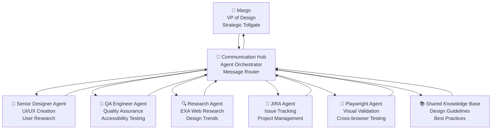

# 🎭 Margo Agent - VP of Design Automation System

> **A sophisticated multi-agent system for design workflow automation where Margo (VP of Design) serves as the senior "tollgate" for strategic design decisions, supported by specialized agents handling different aspects of the design process.**

## 🎯 Project Overview

The Margo Agent system transforms traditional design workflows into an intelligent, multi-agent orchestrated process. It serves as a **pre-Margo gate** that handles common checks and balances, allowing face-to-face meetings to focus on higher-level strategic thinking.

### ✨ Key Features

- **🤖 Multi-Agent Design Review** - Specialized AI agents for different aspects of design
- **🎯 Strategic Tollgate** - Margo VP agent for senior-level decisions
- **🔄 Workflow Automation** - Intelligent orchestration of design processes
- **📚 Knowledge Management** - Shared learning between agents
- **🔌 Enterprise Integration** - Slack, JIRA, Figma, and Confluence connectivity

## 🏗️ System Architecture

### 🎯 Agent Hierarchy

### 🤖 The Agent Team

| Agent | Role | Capabilities |
|-------|------|-------------|
| **🎯 Margo** | VP of Design | Strategic decisions, final tollgate, senior review |
| **🎨 Sarah** | Senior Designer | UI/UX creation, visual design, user research |
| **🧪 Alex** | QA Engineer | Quality assurance, accessibility testing, validation |
| **🔍 Research Agent** | Web Research | EXA-powered research, design trends, competitive analysis |
| **🎫 JIRA Agent** | Project Management | Issue tracking, ticket creation, workflow automation |
| **💬 Communication Hub** | Orchestrator | Message routing, workflow coordination, agent management |

## 🔄 Workflow Process

### 1. **Pre-Margo Screening**
- Feature guide validation
- Research history checking
- Knowledge gap detection
- Basic design review
- Readiness assessment

### 2. **Multi-Agent Analysis**
- **UI Specialist**: Design craft and visual consistency
- **UX Researcher**: User-centered analysis and research validation  
- **Creative Director**: Innovation and brand alignment
- **VP of Product**: Business strategy and ROI analysis
- **Accessibility Expert**: WCAG compliance and inclusive design
- **Quality Evaluator**: Feature guide validation and cross-referencing

### 3. **Margo Gate Decision**
- Automated threshold evaluation
- Strategic complexity assessment
- Escalation to senior review when needed
- Final approval or feedback

### 4. **Post-Decision Actions**
- JIRA ticket creation
- Knowledge base updates
- Team notifications
- Progress tracking

## 🚀 Deployment Options

The system supports multiple deployment architectures:

### 🌐 Cloud Deployment (Recommended)
- **Cloudflare Workers**: Edge computing with global distribution
- **Vercel**: Frontend hosting with serverless functions
- **Production URLs**: 
  - API: `https://roku-design-review-bot.madetoenvy-llc.workers.dev`
  - Frontend: `https://margo-agent.vercel.app`

### 🖥️ Local Development
- **Streamlit**: Interactive web interface
- **Python Environment**: Full-featured development setup
- **Hot Reload**: Real-time code changes

### 🤖 Slack Integration
- **Bot Commands**: Direct Slack interaction
- **File Upload**: Design review via Slack
- **Notifications**: Automated team updates

## 📊 Current Status

### ✅ Production Ready Components
- 💬 Agent Communication Hub (fully working)
- 🎫 JIRA Integration (configured and ready)
- 🧪 Playwright QA Validation (framework ready)
- 🔍 EXA Research Agent (API integrated)
- 📚 Knowledge Management (shared learning active)
- 🌐 Cloudflare Worker (deployed and healthy)
- 🖥️ Vercel Frontend (responsive interface)

### 🔧 Configuration Required
- OpenAI API keys (for AI agents)
- Slack tokens (for Slack integration)
- JIRA credentials (for issue tracking)
- Figma tokens (for design file access)

## 🎯 Roku-Specific Features

### 🎨 Brand Guidelines Integration
- Roku design system compliance
- TV interface design patterns
- Accessibility standards for streaming devices
- Brand color and typography validation

### 📺 TV-Specific Design Review
- 10-foot UI principles
- Remote control navigation patterns
- Performance considerations for streaming devices
- Cross-platform compatibility checks

### 🏢 Enterprise Workflow
- Roku JIRA integration
- Team collaboration patterns
- VP preference customization
- Automated compliance checking

## 📚 Documentation

For detailed information, see:
- [Quick Start Guide](QUICK_START.md) - Get up and running in 30 minutes
- [Deployment Guide](DEPLOYMENT_GUIDE.md) - Complete deployment instructions
- [Agent Architecture](AGENT_ARCHITECTURE.md) - Technical implementation details
- [Integration Guide](INTEGRATION_GUIDE.md) - Slack, JIRA, Figma setup
- [Roku Specific Features](ROKU_SPECIFIC.md) - TV design guidelines and patterns

## 🤝 Contributing

This project follows enterprise development practices:
- Type hints for all Python functions
- Comprehensive docstrings
- PEP 8 style guidelines
- LangChain patterns for AI interactions
- Modular agent architecture

For development setup and contribution guidelines, see [Development Guide](DEVELOPMENT_GUIDE.md).
